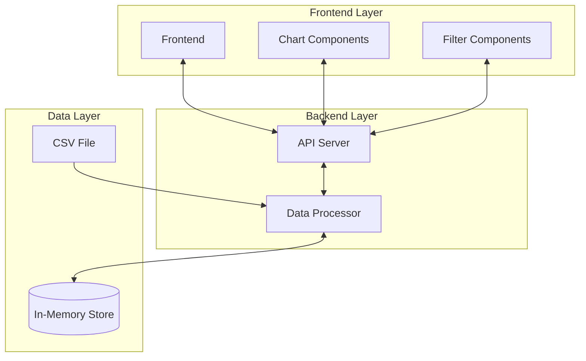
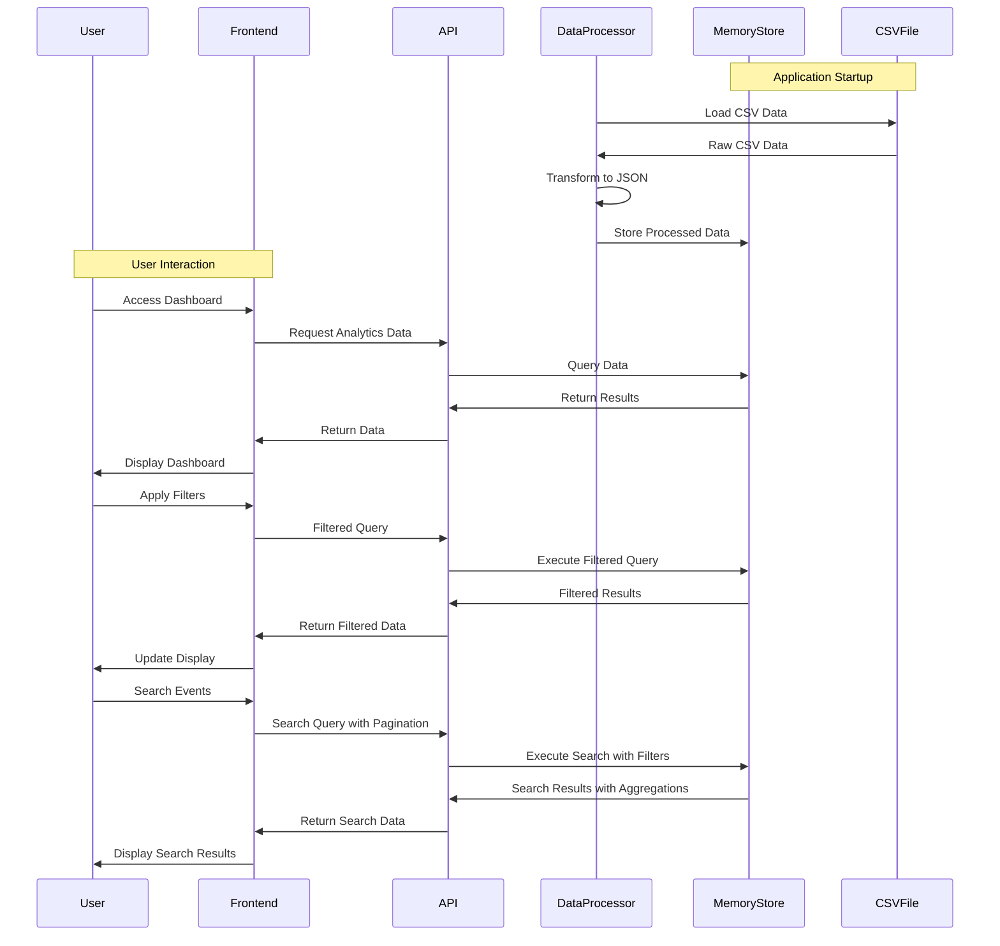

# High-Level Design - Usage Analytics Dashboard

**File Path:** /docs/02_high_level_design.md  
**Last Updated:** 2025-08-23  
**Author:** AI-Agent  

---

## System Overview

The Usage Analytics Dashboard is a web-based application designed to help internal teams understand customer usage patterns through interactive visualizations and filtering capabilities. The system loads usage data from a local CSV file at startup, processes it into structured JSON format, and stores it in memory for fast analytics queries. This implementation focuses on core functionality without external dependencies.

---

## Architecture Overview

---

## Module: Frontend Application (FRONTEND-001)

### Overview
React-based single-page application providing the user interface for the analytics dashboard.

### Responsibilities
- Render interactive data visualizations
- Handle user interactions and filtering
- Manage application state
- Provide responsive design across devices
- Implement search functionality

### Interfaces
- **API Endpoints**: RESTful API calls to backend
- **Input**: User interactions, filter selections, search queries
- **Output**: Charts, tables, metrics displays

### Related Stories
- STORY-001: Time-based Usage Trends
- STORY-002: Historical Metrics Dashboard
- STORY-005: Multi-dimensional Filters
- STORY-006: Freeform Text Search
- STORY-008: Responsive Dashboard Layout
- STORY-009: Interactive Data Visualization

---

## Module: Backend API Server (BACKEND-001)

### Overview
Go-based REST API server handling business logic, data processing, and serving analytics data from in-memory storage.

### Responsibilities
- Process and aggregate usage data from in-memory store
- Serve filtered and processed data to frontend
- Handle data transformation and validation
- Provide analytics endpoints for dashboard

### Interfaces
- **API**: `GET /api/v1/events`, `GET /api/v1/trends`, `GET /api/v1/metrics`, `GET /api/v1/companies`, `GET /api/v1/event-types`, `GET /api/v1/analytics/companies`, `GET /api/v1/analytics/event-distribution`, `GET /api/v1/analytics/retention`
- **Data Store**: Read operations from in-memory data structures via DataService
- **Data Processor**: Integration with CSV processing and transformation
- **System Endpoints**: `GET /health`, `GET /` (root endpoint)

### Related Stories
- STORY-001: Time-based Usage Trends
- STORY-002: Historical Metrics Dashboard
- STORY-003: Event Type Analytics
- STORY-004: Company-based Usage Insights
- STORY-005: Multi-dimensional Filters
- STORY-016: Multi-Company Trends Visualization
- STORY-017: Enhanced Filtered Metrics
- STORY-018: Data Enrichment and Enhancement
- STORY-019: System Monitoring and Health Checks
- STORY-020: Unified Search with Advanced Pagination

---

## Module: Data Processing Engine (PROCESSING-001)

### Overview
Core data processing system for ingesting CSV data at startup and transforming it into structured JSON format for in-memory storage.

### Responsibilities
- Load and parse CSV file at application startup
- Transform CSV data into structured JSON format with data enrichment
- Validate data integrity and handle errors with multiple timestamp formats
- Store processed data in memory for fast access
- Provide data access methods for analytics
- Extract company names, user information, and endpoints from content
- Support unified search and filtering with pagination
- Calculate aggregations and metrics

### Interfaces
- **Input**: Local CSV file with 9 columns (id, created_at, company_id, type, content, attribute, updated_at, original_timestamp, value)
- **Output**: Structured JSON data in memory with enriched fields (CompanyName, User, Endpoint)
- **Storage**: In-memory data structures (maps, slices) via DataService
- **Data Enrichment**: Company name, user, and endpoint extraction from content field

### Related Stories
- STORY-011: CSV Data Ingestion
- STORY-012: Data Transformation and Validation
- STORY-013: In-Memory Data Storage
- STORY-018: Data Enrichment and Enhancement

---

## Module: In-Memory Data Store (MEMORY-001)

### Overview
In-memory data storage system for fast access to processed usage data and analytics results.

### Responsibilities
- Store processed usage events in memory via DataService
- Provide fast data access for analytics queries with filtering and search
- Support data filtering and aggregation with multi-dimensional criteria
- Maintain data consistency during runtime with thread-safe operations
- Handle memory management and optimization
- Support unified search with text queries across multiple fields
- Provide pagination and aggregations for large datasets

### Interfaces
- **Data Structures**: Maps, slices, and custom structs (UsageEvent, Company, SearchRequest, etc.)
- **Queries**: In-memory filtering and aggregation methods with search capabilities
- **Access**: Thread-safe data access methods via DataService
- **Search**: Text-based search across content, attributes, types, company names, users, and endpoints
- **Pagination**: Page-based data access with metadata

### Related Stories
- STORY-001: Time-based Usage Trends
- STORY-002: Historical Metrics Dashboard
- STORY-003: Event Type Analytics
- STORY-004: Company-based Usage Insights
- STORY-016: Multi-Company Trends Visualization
- STORY-017: Enhanced Filtered Metrics
- STORY-020: Unified Search with Advanced Pagination

---

## Key Integrations

### Data Source Integration
- **CSV File Processing**: Local CSV file ingestion at application startup with data enrichment
- **Data Transformation**: CSV to JSON conversion with validation and field extraction
- **Data Enrichment**: Company name, user, and endpoint extraction from content field
- **Configuration**: Environment-based data path configuration (DATA_PATH)

### Third-party Integrations
- **Chart Libraries**: Integration with Recharts for visualizations (LineChart, BarChart, PieChart)
- **UI Components**: shadcn/ui React components for consistent design
- **CSV Parser**: Go CSV library for file processing
- **HTTP Framework**: Gin framework for REST API
- **Routing**: React Router for frontend navigation
- **State Management**: React hooks and context for state management

### Future Integrations (Not in Current Implementation)
- **Database**: PostgreSQL or similar for persistent storage
- **Authentication**: OAuth or JWT-based authentication
- **Search Engine**: Elasticsearch for full-text search (currently using in-memory search)
- **Caching**: Redis for performance optimization
- **Containerization**: Docker for deployment
- **Monitoring**: Prometheus, Grafana for metrics

---

## Data Flow Architecture

---

## Security Architecture

### Core Security (Minimal)
- Input validation and sanitization for API endpoints
- Basic error handling without exposing sensitive information
- Secure coding practices for data processing

### Future Security Enhancements (Not in Current Implementation)
- JWT-based authentication for API access
- Role-based access control (RBAC)
- Session management with Redis
- API rate limiting and throttling
- Data encryption at rest and in transit
- Secure API endpoints with HTTPS
- Audit logging for data access
- Container-based deployment with security scanning

---

## Scalability Considerations

### Core Performance
- In-memory data access for fast query response
- Efficient data structures for filtering and aggregation
- Basic error handling and logging
- Simple file-based data loading
- Unified search with text queries across multiple fields
- Pagination support for large datasets
- Data enrichment with company name and user extraction
- Multi-company trends visualization

### Future Scalability Enhancements (Not in Current Implementation)
- Horizontal scaling with stateless API design
- Load balancing across multiple API instances
- Database integration with read replicas
- CDN for static asset delivery
- Caching strategies for frequently accessed data
- Asynchronous processing for heavy computations
- Pagination and lazy loading for large datasets
- Application performance monitoring (APM)
- Database performance metrics
- User experience monitoring
- Error tracking and alerting

---

## Technology Stack

### Frontend
- **Framework**: React 19 with TypeScript
- **UI Library**: shadcn/ui components
- **Charts**: Recharts (LineChart, BarChart, PieChart)
- **State Management**: React hooks and context for state management
- **Build Tool**: Vite
- **Routing**: React Router with lazy loading
- **Architecture**: Feature-based folder structure with shared components
- **Custom Hooks**: Business logic separation with custom hooks

### Backend
- **Language**: Go
- **Framework**: Gin HTTP framework
- **Data Storage**: In-memory data structures via DataService
- **CSV Processing**: Go standard library CSV package with multiple timestamp formats
- **JSON Processing**: Go standard library encoding/json
- **API Design**: RESTful endpoints with query parameter support
- **Data Enrichment**: Company name, user, and endpoint extraction
- **Search**: In-memory text search across multiple fields

### Core Infrastructure
- **Development**: Local development environment
- **Data Source**: Local CSV file with configurable path (DATA_PATH)
- **Deployment**: Simple binary execution
- **Configuration**: Environment-based configuration (PORT, DATA_PATH)
- **Health Monitoring**: Health check endpoint (/health)
- **API Documentation**: Root endpoint (/) with available endpoints

### Future Infrastructure (Not in Current Implementation)
- **Database**: PostgreSQL
- **Cache**: Redis
- **Search**: Elasticsearch or PostgreSQL full-text search
- **Containerization**: Docker
- **Orchestration**: Kubernetes or Docker Compose
- **CI/CD**: GitHub Actions
- **Monitoring**: Prometheus, Grafana
- **Logging**: ELK Stack or similar

---

## Implemented Features - Additional Capabilities

### Advanced Analytics Features
- **Multi-Company Trends**: Line/bar charts showing trends across multiple companies
- **Enhanced Metrics**: Unique users, average events per company, top event types
- **Retention Analytics**: Cohort-based retention curves with daily/weekly/monthly analysis
- **Data Enrichment**: Automatic extraction of company names, users, and endpoints from content
- **Unified Search**: Text-based search across all event fields with pagination
- **Advanced Filtering**: Multi-dimensional filtering with date ranges, companies, and event types

### System Features
- **Health Monitoring**: `/health` endpoint for system status
- **API Documentation**: Root endpoint with available endpoints listing
- **Error Handling**: Structured error responses with codes and messages
- **Configuration Management**: Environment-based configuration for data path and port
- **CORS Support**: Cross-origin resource sharing for development

### Frontend Features
- **Feature-Based Architecture**: Organized code structure with shared components
- **Custom Hooks**: Business logic separation for maintainability
- **Responsive Design**: Mobile-friendly interface with Tailwind CSS
- **Interactive Charts**: Multiple chart types (line, bar, pie) with Recharts
- **Advanced UI Components**: shadcn/ui components for consistent design
- **Retention Analytics**: Dedicated retention page with cohort analysis and filtering
